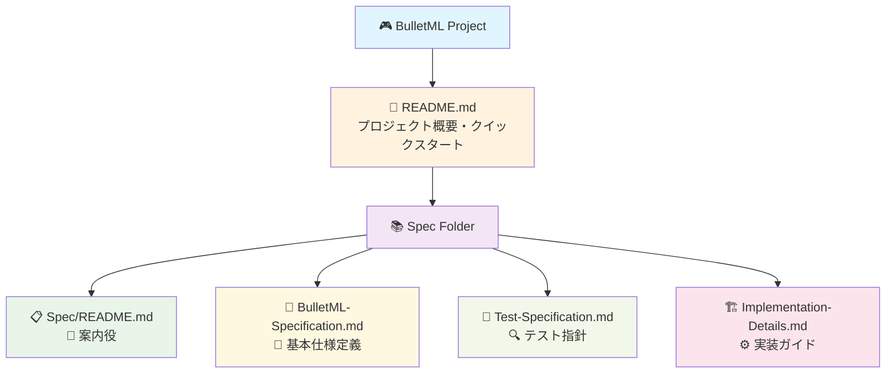

# BulletML 仕様書フォルダ

## 📋 概要

このフォルダには、BulletMLプレイヤーの技術仕様書が含まれています。  
開発者、テスター、および技術的な詳細を理解したいユーザー向けの包括的なドキュメントです。

---

## 📚 ドキュメント一覧

### 🎯 [BulletML-Specification.md](./BulletML-Specification.md)
**BulletML基本仕様書**

- BulletMLの基本概念と要素仕様
- XML構文の詳細定義
- 型システムと計算ルール
- 数式評価の仕様
- 自動ループ機能仕様
- wait倍率機能仕様
- 実装ガイドライン

**対象読者:** 開発者、技術者、BulletML学習者

### 🧪 [Test-Specification.md](./Test-Specification.md)
**テスト仕様書**

- テスト戦略とピラミッド
- 150+のテストケース詳細
- パフォーマンステスト仕様
- CI/CD統合方法
- 品質保証プロセス

**対象読者:** QAエンジニア、開発者、プロジェクトマネージャー

### 🏗️ [Implementation-Details.md](./Implementation-Details.md)
**実装詳細仕様書**

- システムアーキテクチャ
- クラス設計とAPI詳細
- 自動ループ機能実装詳細
- wait倍率機能実装詳細
- パフォーマンス最適化手法
- Unity統合方法
- デバッグ・監視システム

**対象読者:** シニア開発者、アーキテクト、パフォーマンス専門家

---

## 🎯 読み進め方

### 初心者向け
1. 📖 [メインREADME](../README.md) - プロジェクト概要とクイックスタート
2. 🎯 [BulletML-Specification.md](./BulletML-Specification.md) - 基本仕様の理解
3. 🎮 実際にサンプルを動かしてみる

### 開発者向け
1. 🎯 [BulletML-Specification.md](./BulletML-Specification.md) - 仕様の完全理解
2. 🏗️ [Implementation-Details.md](./Implementation-Details.md) - 実装詳細の把握
3. 🧪 [Test-Specification.md](./Test-Specification.md) - テスト手法の学習
4. 💻 コード実装とテスト作成

### QA・テスター向け
1. 🧪 [Test-Specification.md](./Test-Specification.md) - テスト戦略の理解
2. 🎯 [BulletML-Specification.md](./BulletML-Specification.md) - 仕様の確認
3. 🔧 テスト環境の構築とテスト実行

---

## 📊 ドキュメント関係図

---

## 🔍 仕様書の特徴

### 📖 包括性
- BulletML 0.21仕様の完全準拠
- 150+のテストケースによる検証
- 実装からデバッグまでの全工程をカバー

### 🎯 実用性
- コード例とサンプルが豊富
- 段階的な学習パス提供
- 実際のプロジェクトで即座に使用可能

### 🔧 技術性
- パフォーマンス最適化手法
- Unity固有の実装詳細
- プロダクションレベルの品質管理

---

## 🚀 更新履歴

| バージョン | 日付 | 変更内容 | 文書 |
|-----------|------|----------|------|
| 1.0.0 | 2024/12 | 初版作成 | 全文書 |
| 1.0.1 | 2024/12 | ホーミングレーザーテスト追加 | Test-Specification |
| 1.1.0 | 2025/8 | 仕様書更新、技術詳細拡充 | 全文書 |

---

## 🤝 貢献

仕様書の改善にご協力ください：

### 報告・提案
- 不明確な記述の指摘
- 追加すべき仕様の提案
- 誤字・脱字の修正
- サンプルコードの改善

### 貢献方法
1. GitHubでIssue作成
2. Pull Request提出
3. メール連絡

---

## 📞 サポート

### 技術的質問
- GitHub Issues
- プロジェクトディスカッション

### 文書に関する質問
- 仕様の解釈
- 実装方法
- テスト手法

### 商用利用相談
- ライセンス確認
- 技術サポート
- カスタマイズ相談

---

## 📚 外部参考資料

### BulletML関連
- [BulletML公式サイト](https://www.asahi-net.or.jp/~cs8k-cyu/bulletml/) (ABA Games)
- BulletML DTD仕様
- BulletML RELAX NG仕様

### Unity関連
- [Unity Documentation](https://docs.unity3d.com/)
- [Unity Test Framework](https://docs.unity3d.com/Packages/com.unity.test-framework@latest)
- [Unity Performance Best Practices](https://docs.unity3d.com/Manual/BestPractice.html)

### 設計パターン
- Object Pooling Pattern
- Observer Pattern
- Command Pattern

---

## 🎯 この仕様書で得られること

### 開発者
- BulletMLの完全な理解
- 高品質な実装手法
- 効率的なテスト方法
- パフォーマンス最適化技術

### プロジェクトマネージャー
- プロジェクトの技術的複雑さの把握
- 品質保証プロセスの理解
- リスク管理のための情報

### 学習者
- 弾幕システムの設計思想
- XML処理の実装パターン
- Unity統合のベストプラクティス
- テスト駆動開発の実例

---

**🎮 Let's master BulletML together!** 🎮