# BulletML テスト仕様書

## 📋 概要

この文書はBulletMLプレイヤーのテスト仕様を定義します。  
テスト駆動開発（TDD）によって100%の信頼性を保証します。

**テストフレームワーク**: Unity Test Framework  
**テストカバレッジ**: 28個のテストクラス、210+個のテストケース  
**更新日**: 2025年8月

---

## 🎯 テスト戦略

### テストピラミッド

```mermaid
graph TD
    subgraph Pyramid["🧪 テストピラミッド"]
        Integration["🔗 統合テスト<br/>📦 XMLファイル、パフォーマンス<br/>📊 (少数)"]
        Function["⚙️ 機能テスト<br/>🔄 コンポーネント間の連携<br/>📈 (中程度)"]
        Unit["🔧 単体テスト<br/>🧱 個別クラス・メソッド<br/>📋 (多数)"]
    end
    
    Integration --- Function
    Function --- Unit
    
    style Integration fill:#ffcccb
    style Function fill:#fff2cc
    style Unit fill:#ccffcc
```



### テスト分類

| カテゴリ | テスト数 | 目的 |
|---------|---------|------|
| **EditModeテスト** | 210+ | ロジックの正確性検証 |
| **PlayModeテスト** | 20+ | Unity統合環境での動作確認 |
| **XMLファイルテスト** | 15+ | 実際のBulletMLファイルでの検証 |
| **パフォーマンステスト** | 10+ | 性能・メモリ使用量測定 |

---

## 🧪 EditModeテスト（単体テスト）

### 1. コアシステムテスト

#### BulletMLParserTests.cs
```csharp
[Test] public void Parse_ValidXML_Success()
[Test] public void Parse_InvalidXML_ThrowsException()
[Test] public void Parse_ElementTypes_CorrectlyParsed()
[Test] public void Parse_Attributes_CorrectlyExtracted()
[Test] public void Parse_NestedElements_CorrectlyStructured()
```

**テスト対象:**
- XML構文解析の正確性
- 要素タイプの正しい識別
- 属性値の適切な抽出
- ネストした要素の構造保持

#### BulletMLExecutorTests.cs
```csharp
[Test] public void ExecuteFireCommand_CreatesCorrectBullet()
[Test] public void ExecuteRepeatCommand_CorrectIterationCount()
[Test] public void ExecuteWaitCommand_CorrectFrameDelay()
[Test] public void ExecuteChangeDirection_GradualDirectionChange()
[Test] public void ExecuteChangeSpeed_GradualSpeedChange()
[Test] public void ExecuteAccelCommand_AccelerationApplied()
```

**テスト対象:**
- 各コマンドの正確な実行
- パラメータの適切な処理
- 状態変化の正しい管理
- エラー処理の妥当性

#### ExpressionEvaluatorTests.cs
```csharp
[Test] public void Evaluate_ArithmeticExpression_CorrectResult()
[Test] public void Evaluate_VariableSubstitution_CorrectValue()
[Test] public void Evaluate_RandVariable_ValidRange()
[Test] public void Evaluate_RankVariable_ValidRange()
[Test] public void Evaluate_ParameterVariable_CorrectSubstitution()
[Test] public void Evaluate_ComplexExpression_CorrectCalculation()
```

**テスト対象:**
- 四則演算の正確性
- 変数置換の正しさ
- ランダム値の範囲確認
- 複雑な数式の評価精度

### 2. 弾管理テスト

#### BulletMLBulletTests.cs
```csharp
[Test] public void Constructor_ValidParameters_CorrectInitialization()
[Test] public void Update_MovementCalculation_CorrectPosition()
[Test] public void SetDirection_AngleNormalization_ValidRange()
[Test] public void SetSpeed_SpeedChange_CorrectVelocity()
[Test] public void GetVelocityVector_CoordinateSystem_CorrectVector()
```

**テスト対象:**
- 弾の初期化
- 位置更新の正確性
- 座標系変換の正しさ
- 速度ベクトル計算

### 3. 高度機能テスト

#### BulletMLFireRefTests.cs
```csharp
[Test] public void FireRef_LabelResolution_CorrectFireElement()
[Test] public void FireRef_ParameterPassing_CorrectSubstitution()
[Test] public void FireRef_NestedParameters_CorrectEvaluation()
[Test] public void FireRef_InvalidLabel_ThrowsException()
```

**テスト対象:**
- ラベル参照の解決
- パラメータ渡しの正確性
- ネストしたパラメータの処理
- エラーハンドリング

#### BulletMLSequenceTests.cs
```csharp
[Test] public void SequenceDirection_CumulativeChange_CorrectProgression()
[Test] public void SequenceSpeed_ChangeSpeedContext_CorrectAccumulation()
[Test] public void SequenceSpeed_FireContext_CorrectRelative()
[Test] public void SequenceAccel_CumulativeAcceleration_CorrectProgression()
```

**テスト対象:**
- sequence型の累積変化
- コンテキスト依存の動作
- 状態の正しい保持
- リセット機能

### 4. 複雑パターンテスト

#### BulletMLHomingLaserTests.cs
```csharp
[Test] public void HomingLaser_ParseSuccessfully()
[Test] public void HomingLaser_InitialBurstPattern_8Waves()
[Test] public void HomingLaser_BulletSpeedTransition()
[Test] public void HomingLaser_HomingBehavior()
[Test] public void HomingLaser_RankInfluence()
[Test] public void HomingLaser_RandomDirectionRange()
[Test] public void HomingLaser_CompletePattern_8Waves()
```

**テスト対象:**
- 複雑な弾幕パターンの実行
- 3段階速度変化の正確性
- ホーミング動作の検証
- ランク値の影響確認

#### BulletMLGuwangeCircleFireTests.cs
```csharp
[Test] public void GuwangeCircleFire_CircularPattern_18Directions()
[Test] public void GuwangeCircleFire_TwoStagePattern_ParentChild()
[Test] public void GuwangeCircleFire_VanishTiming_CorrectBehavior()
[Test] public void GuwangeCircleFire_RandomizedDirection_ValidRange()
```

**テスト対象:**
- 二段階円形弾幕の実行
- 親弾・子弾の連携
- 消滅タイミングの正確性
- ランダム化の妥当性

#### BulletMLProgearGrowBulletsTests.cs
```csharp
[Test] public void ProgearGrowBullets_SeedBulletPattern_RankDependent()
[Test] public void ProgearGrowBullets_FanShapeDirection_CorrectAngles()
[Test] public void ProgearGrowBullets_SeedSpeedTransition_DecelerationToStop()
[Test] public void ProgearGrowBullets_ChildBulletGeneration_SequenceSpeed()
[Test] public void ProgearGrowBullets_RankInfluence_BulletCount()
[Test] public void ProgearGrowBullets_CompletePattern_TotalBulletCount()
[Test] public void ProgearGrowBullets_SeedVanish_ProperCleanup()
```

**テスト対象:**
- 成長する弾幕の実行（seed → 停止 → 爆発）
- 扇状発射パターンとランク依存弾数
- 親弾の減速・停止動作
- 子弾のsequence速度増加
- 適切な弾の消滅処理

#### BulletMLDaiouzyouHibachiTests.cs
```csharp
[Test] public void DaiouzyouHibachi_ParseSuccessfully()
[Test] public void DaiouzyouHibachi_SingleCycle_17Bullets()
[Test] public void DaiouzyouHibachi_AimDirection_PlayerTargeting()
[Test] public void DaiouzyouHibachi_SequenceDirection_CumulativeChange()
[Test] public void DaiouzyouHibachi_FireRefExecution_16References()
[Test] public void DaiouzyouHibachi_RankInfluence_RepeatCount()
[Test] public void DaiouzyouHibachi_Speed_RankDependent()
[Test] public void DaiouzyouHibachi_WaitTime_RankDependent()
[Test] public void DaiouzyouHibachi_HighDensity_MultiCycle()
[Test] public void DaiouzyouHibachi_Performance_BulletManagement()
```

**テスト対象:**
- 超高密度弾幕（ランク1.0で1,360発）
- デュアル狙い撃ちシステム（メイン弾+sequence弾群）
- fireRef参照による16発連射
- ランク依存の繰り返し回数・速度・待機時間
- 大量弾生成時のパフォーマンス

#### BulletMLActionRefTests.cs
```csharp
[Test] public void ActionRef_BasicReference_ExecutesCorrectly()
[Test] public void ActionRef_WithParameters_PassesValuesCorrectly()
[Test] public void ActionRef_NestedReference_ExecutesSequentially()
[Test] public void ActionRef_ComplexParameters_EvaluatesCorrectly()
[Test] public void ActionRef_WithRepeat_ExecutesMultipleTimes()
[Test] public void ActionRef_WithFireRef_CombinedExecution()
[Test] public void ActionRef_RecursiveReference_HandlesCorrectly()
[Test] public void ActionRef_Performance_LargeScale()
[Test] public void ActionRef_InvalidLabel_HandlesGracefully()
```

**テスト対象:**
- actionRef基本参照システム
- パラメータ渡し（$1, $2, $3）の正確性
- ネスト・再帰的actionRef実行
- 複雑なパラメータ式評価（$rank, $randとの組み合わせ）
- repeatとの組み合わせ実行
- fireRefとの連携動作
- エラーハンドリング（不正ラベル参照）
- 大量actionRef実行時のパフォーマンス

#### BulletMLBulletRefTests.cs
```csharp
[Test] public void BulletRef_BasicReference_InheritsProperties()
[Test] public void BulletRef_WithParameters_PassesValuesCorrectly()
[Test] public void BulletRef_WithAction_ExecutesCorrectly()
[Test] public void BulletRef_ComplexParameters_EvaluatesCorrectly()
[Test] public void BulletRef_NestedReference_ResolvesCorrectly()
[Test] public void BulletRef_WithRepeat_CreatesMultipleBullets()
[Test] public void BulletRef_WithFireRef_CombinedExecution()
[Test] public void BulletRef_Performance_LargeScale()
[Test] public void BulletRef_InvalidLabel_HandlesGracefully()
```

**テスト対象:**
- bulletRef基本参照システム
- 弾属性の継承（速度、アクション）
- パラメータ渡し（$1, $2, $3）の正確性
- 弾アクションの実行検証
- 複雑なパラメータ式評価（$rank, $randとの組み合わせ）
- ネストしたbulletRef参照
- repeatとの組み合わせ実行
- fireRefとの連携動作
- エラーハンドリング（不正ラベル参照時の通常弾処理）
- 大量bulletRef実行時のパフォーマンス

#### BulletMLComplexExpressionTests.cs
```csharp
[Test] public void Expression_BasicArithmetic_EvaluatesCorrectly()
[Test] public void Expression_OperatorPrecedence_FollowsCorrectOrder()
[Test] public void Expression_NestedParentheses_EvaluatesCorrectly()
[Test] public void Expression_VariableCombinations_EvaluatesCorrectly()
[Test] public void Expression_ComplexNestedVariables_EvaluatesCorrectly()
[Test] public void Expression_BoundaryValues_HandlesCorrectly()
[Test] public void Expression_ZeroDivision_HandlesGracefully()
[Test] public void Expression_FloatingPointPrecision_MaintainsAccuracy()
[Test] public void Expression_EmptyAndNull_HandlesGracefully()
[Test] public void Expression_VariableNotFound_DefaultsToZero()
[Test] public void Expression_Performance_LargeScale()
[Test] public void Expression_ExtremeNesting_HandlesCorrectly()
[Test] public void Expression_ModuloOperations_EvaluatesCorrectly()
[Test] public void Expression_ParameterDynamicChange_EvaluatesCorrectly()
```

**テスト対象:**
- 基本四則演算（+, -, *, /, %）の正確性
- 演算子優先度と左結合性の検証
- 多層括弧ネスト（5層以上）の評価
- $rand, $rank, $1, $2, $3変数の複雑な組み合わせ
- 境界値処理（大数、小数、負数、ゼロ）
- ゼロ除算・剰余でのInfinity/NaN処理
- 浮動小数点精度と累積誤差の管理
- 空文字列・null入力の安全処理
- 存在しない変数の規定値処理
- 大量計算（1000回）のパフォーマンス
- 極端なネストレベル（10層）の処理
- 剰余演算子の詳細な動作検証
- パラメータ動的変更後の正確な再評価

#### BulletMLErrorHandlingTests.cs
```csharp
[Test] public void ErrorHandling_InvalidActionRef_LogsErrorAndContinues()
[Test] public void ErrorHandling_InvalidBulletRef_LogsErrorAndContinues()
[Test] public void ErrorHandling_InvalidFireRef_LogsErrorAndContinues()
[Test] public void ErrorHandling_CircularActionRef_PreventesInfiniteLoop()
[Test] public void ErrorHandling_ExtremelyLargeValues_HandlesGracefully()
[Test] public void ErrorHandling_NegativeValues_HandlesCorrectly()
[Test] public void ErrorHandling_EmptyElements_HandlesGracefully()
[Test] public void ErrorHandling_MassiveRepeatCount_PreventesPerformanceIssues()
[Test] public void ErrorHandling_DeepActionNesting_PreventesStackOverflow()
[Test] public void ErrorHandling_InvalidExpressions_HandlesGracefully()
[Test] public void ErrorHandling_MemoryStability_NoMemoryLeaks()
[Test] public void ErrorHandling_ConcurrentExecution_ThreadSafe()
```

**テスト対象:**
- 不正参照エラー（存在しないactionRef/bulletRef/fireRef）
- 循環参照・無限ループ防止機能
- 極端値処理（極大値、負値、空要素）
- 不正数式・構文エラーの安全処理
- パフォーマンス制限（大量repeat、深いネスト）
- スタックオーバーフロー防止機能
- メモリリーク・安定性確認
- 並行実行時の安全性（簡易スレッドセーフティ）
- エラーログの適切な出力
- 例外発生時の処理継続能力
- デフォルト値フォールバック機能
- ガベージコレクション後のメモリ使用量検証

---

## 🎮 PlayModeテスト（統合テスト）

### BulletMLIntegrationTests.cs
```csharp
[UnityTest] public IEnumerator Integration_FullBulletMLExecution_Success()
[UnityTest] public IEnumerator Integration_MultipleXMLFiles_AllExecute()
[UnityTest] public IEnumerator Integration_HighBulletCount_Performance()
[UnityTest] public IEnumerator Integration_TargetTracking_CorrectAiming()
```

**テスト対象:**
- Unity環境での完全な統合動作
- 複数XMLファイルの同時実行
- 高負荷時のパフォーマンス
- リアルタイムターゲット追跡

---

## 📄 XMLファイルテスト

### BulletMLXmlFileTests.cs

**テスト対象XMLファイル:**

| ファイル名 | パターン | テスト項目 |
|-----------|----------|-----------|
| `sample01.xml` | 基本発射 | パース成功、基本動作 |
| `sample02.xml` | 円形弾幕 | sequence型direction |
| `sample03.xml` | 螺旋弾幕 | 連続角度変化 |
| `changeSpeed.xml` | 速度変化 | changeSpeedコマンド |
| `changeDirection.xml` | 方向変化 | changeDirectionコマンド |
| `accel.xml` | 加速度 | accelコマンド |
| `[G_DARIUS]_homing_laser.xml` | ホーミング | 複雑な多段階パターン |
| `[Guwange]_round_2_boss_circle_fire.xml` | 二段階円形 | 親弾・子弾システム |
| `[Progear]_round_1_boss_grow_bullets.xml` | 成長弾幕 | 停止→爆発パターン |
| `[Daiouzyou]_hibachi_1.xml` | 超高密度弾幕 | 1,360発の弾幕地獄 |

**テスト内容:**
```csharp
[Test] public void XmlFile_Parse_Success()                    // パース成功
[Test] public void XmlFile_Execute_NoErrors()                 // エラーなし実行
[Test] public void XmlFile_BulletGeneration_ExpectedCount()   // 期待弾数
[Test] public void XmlFile_PatternAccuracy_CorrectBehavior()  // パターン正確性
```

---

## 📊 パフォーマンステスト

### BulletMLPerformanceTests.cs

#### メモリ使用量テスト
```csharp
[Test] public void Performance_BulletPooling_MemoryEfficient()
[Test] public void Performance_LargeBulletCount_StableMemory()
[Test] public void Performance_GarbageCollection_Minimal()
```

**測定項目:**
- オブジェクトプーリング効果
- メモリリーク検出
- ガベージコレクション頻度

#### フレームレートテスト
```csharp
[Test] public void Performance_1000Bullets_60FPS()
[Test] public void Performance_ComplexPatterns_StableFramerate()
[Test] public void Performance_MultipleExecutors_Performance()
```

**測定項目:**
- 大量弾処理時のFPS
- 複雑パターン実行時の安定性
- 複数エクゼキューター同時実行

---

## 🎯 テストデータ管理

### テスト用XMLファイル

**基本パターン:**
```xml
<!-- プレイヤー狙い弾（最小構成） -->
<action label="top">
<fire><bullet/></fire>
</action>
```

**中級パターン:**
```xml
<!-- パラメータ付きfireRef -->
<fire label="burst">
 <direction type="sequence">$1</direction>
 <speed>$2</speed>
 <bullet/>
</fire>

<action label="top">
 <fireRef label="burst">
  <param>45</param>
  <param>2.5</param>
 </fireRef>
</action>
```

**上級パターン:**
```xml
<!-- 多段階変化+ホーミング -->
<bullet label="complex">
 <speed>2</speed>
 <action>
  <changeSpeed><speed>0.3</speed><term>30</term></changeSpeed>
  <wait>100</wait>
  <changeSpeed><speed>5</speed><term>100</term></changeSpeed>
 </action>
 <action>
  <repeat><times>9999</times>
   <action>
    <changeDirection>
     <direction type="aim">0</direction>
     <term>60-$rank*20</term>
    </changeDirection>
    <wait>5</wait>
   </action>
  </repeat>
 </action>
</bullet>
```

---

## 🔧 テスト実行環境

### 環境設定

**Unity設定:**
```
Unity Version: 2021.3+
Test Framework: Unity Test Framework
Scripting Backend: Mono / IL2CPP
Platform: Windows, Mac, Linux
```

**テストランナー設定:**
```
EditMode Tests: 高速実行、ロジック検証
PlayMode Tests: 実環境検証、統合テスト
Batch Mode: CI/CD自動実行対応
```

### 継続的インテグレーション

**GitHub Actions設定例:**
```yaml
name: Unity Tests
on: [push, pull_request]

jobs:
  test:
    runs-on: ubuntu-latest
    steps:
      - uses: actions/checkout@v2
      - uses: game-ci/unity-test-runner@v2
        with:
          testMode: all
          artifactsPath: test-results
```

---

## 📈 テスト結果分析

### カバレッジレポート

| コンポーネント | カバレッジ | 重要度 |
|---------------|-----------|-------|
| **BulletMLParser** | 100% | 🔴 Critical |
| **BulletMLExecutor** | 98% | 🔴 Critical |
| **ExpressionEvaluator** | 100% | 🔴 Critical |
| **BulletMLBullet** | 95% | 🟡 High |
| **BulletMLDocument** | 100% | 🟡 High |
| **Utilities** | 85% | 🟢 Medium |

### 品質指標

**成功基準:**
- 全テストケース成功率: 100%
- EditModeテスト実行時間: < 30秒
- PlayModeテスト実行時間: < 2分
- メモリリーク: ゼロ
- パフォーマンス劣化: なし

---

## 🚀 テスト改善計画

### 短期計画
- [ ] PlayModeテストの拡充
- [ ] パフォーマンステストの自動化
- [ ] カバレッジ100%達成

### 長期計画
- [ ] ファズテスト導入
- [ ] 負荷テストの体系化
- [ ] クロスプラットフォームテスト

---

## 📚 参考資料

- [Unity Test Framework Documentation](https://docs.unity3d.com/Packages/com.unity.test-framework@latest)
- [BulletML公式仕様](https://www.asahi-net.or.jp/~cs8k-cyu/bulletml/)
- プロジェクトテストコード実装